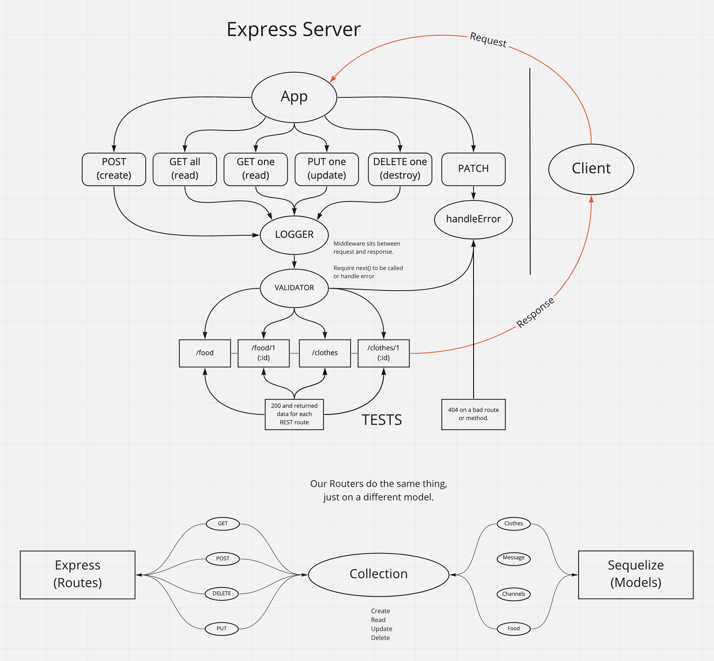

# API Server

Created by Ryan Emmans

## Installation

None currently.

## Summary of Problem Domain

### *Phase 3 Requirements*

Build a REST API using Express, by creating a proper series of endpoints that perform CRUD operations on a Postgres SQL Database, using the REST standard

## Links to application deployment

- [Heroku Main Branch](https://ryanemmans-api-server.herokuapp.com/)
- [GitHub Actions](https://github.com/ryanemmans/api-server/actions)
- [Pull Requests](https://github.com/ryanemmans/api-server/pulls?q=is%3Apr+is%3Aclosed)

## UML

## Routes

### **Add a Record**

- CRUD Operation: Create
- REST Method: POST
- Path: /food
- Input: JSON Object in the Request Body
- Returns: The record that was added to the database.
  - You must generate an ID and attach it to the object.
  - You should verify that only the fields you define get saved as a record.

### **Get All Records**

- CRUD Operation: Read
- REST Method: GET
- Path: /food
- Returns: An array of objects, each object being one entry from your database.

### **Get One Record**

- CRUD Operation: Read
- REST Method: GET
- Path: /food/1
- Returns: The object from the database, which has the id matching that which is in the path.

### **Update A Record**

- CRUD Operation: Update
- REST Method: PUT
- Path: /food/1
- Input: JSON Object in the Request Body
- Returns: The object from the database, which has the id matching that which is in the path, with the updated/changed data.
  - You should verify that only the fields you define get saved as a record.

### **Delete A Record**

- CRUD Operation: Destroy
- REST Method: DELETE
- Path: /food/1
- Returns: The record from the database as it exists after you delete it (i.e. null).

## Notes
